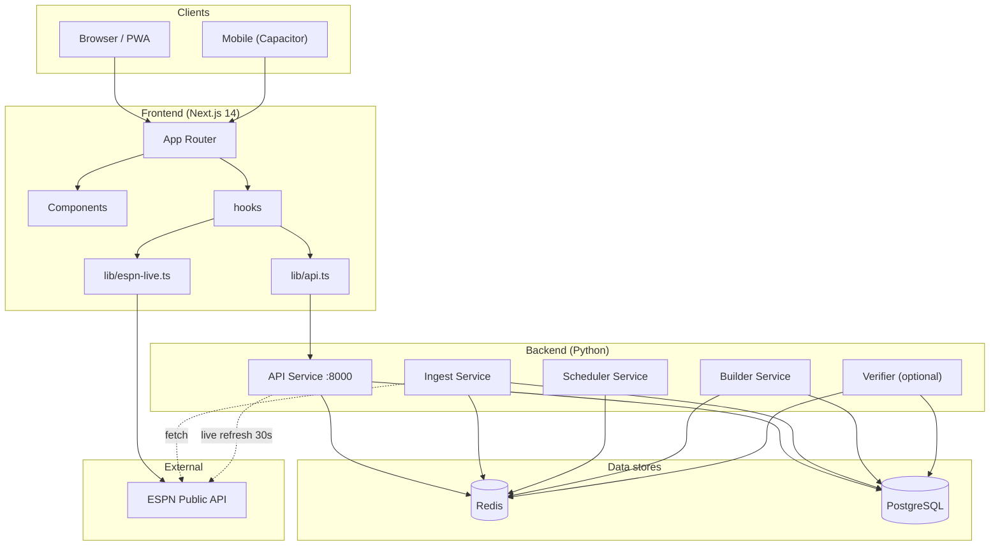
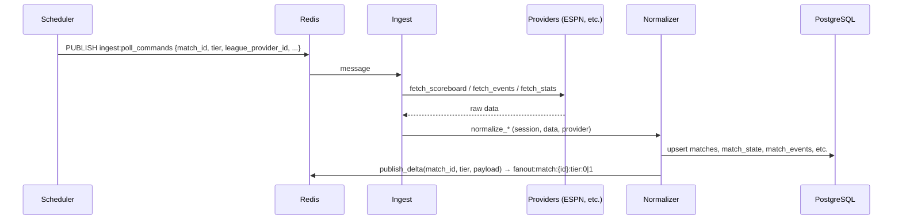
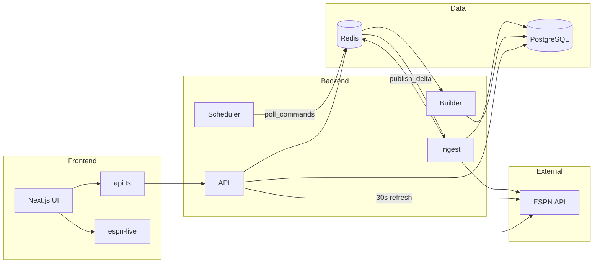

# LiveView — Full Architecture Map

Accurate map of web frontend, backend services, data stores, and data flow (derived from the codebase).

---

## 1. System overview



---

## 2. Backend services (entrypoint.sh)

| Service    | Command                    | Role |
|-----------|----------------------------|------|
| **api**   | `python -m api.service`     | REST + WebSocket; background: phase-sync (60s), live score refresh (ESPN 30s), news RSS fetch (5 min → DB). |
| **ingest**| `python -m ingest.service` | Subscribes to `ingest:poll_commands`, fetches from providers (ESPN, Football-Data, Sportradar, TheSportsDB), normalizes → DB and publishes deltas to Redis. |
| **scheduler** | `python -m scheduler.service` | Leader-elected; discovers matches (ESPN schedule sync), publishes poll commands to `ingest:poll_commands`. |
| **builder** | `python -m builder.service` | Subscribes to `fanout:match:*:tier:0` (scoreboard) and `fanout:match:*:tier:1` (events); generates synthetic timeline events, reconciles with real events, persists to DB. |
| **verifier** | `python -m verifier.main` | Optional; reconciliation/verification using same Redis snapshot and publish_delta contract. |

---

## 3. API service (FastAPI)

### REST routes

| Method | Endpoint | Description |
|--------|----------|-------------|
| GET | `/health` | Liveness: `{"status":"ok","service":"api"}` |
| GET | `/ready` | Readiness: checks Redis + PostgreSQL |
| GET | `/v1/status` | Public status: redis, database, ESPN circuit breaker |
| GET | `/v1/leagues` | All leagues grouped by sport (from DB) |
| GET | `/v1/leagues/{id}/scoreboard` | Scoreboard for one league (DB; ETag optional) |
| GET | `/v1/today` | `?date=YYYY-MM-DD`, `league_ids`, `match_ids`; Redis cache key `today:{date}`; ETag/304 |
| GET | `/v1/matches/{id}` | Match center (score, teams, state) |
| GET | `/v1/matches/{id}/timeline` | Event timeline (`after_seq` pagination) |
| GET | `/v1/matches/{id}/stats` | Team & player stats |
| GET | `/v1/matches/{id}/lineup` | Lineup (e.g. Football-Data when ESPN has none) |
| GET | `/v1/matches/{id}/player-stats` | Player stats (Football-Data fallback) |
| GET | `/v1/news` | Paginated news (`page`, `limit`, `category`, `sport`, `league`, `q`, `hours`) |
| GET | `/v1/news/trending` | Trending articles |
| GET | `/v1/news/breaking` | Breaking (last 6h) |
| GET | `/v1/news/{id}` | Single article |

### WebSocket

- **Path:** `/v1/ws` (or `NEXT_PUBLIC_WS_URL`).
- **Manager:** `api/ws/manager.py` — channel subs, replay-on-connect, heartbeat, Redis pub/sub bridge.
- **Channels:** `fanout:match:{match_id}:tier:{tier}`; clients subscribe per match/tier; server subscribes to `fanout:match:*:tier:*` and forwards to clients.

### API background tasks

- **Phase-sync loop:** Every 60s; marks matches live when `start_time` has passed (within 3h), marks finished when started 3+ hours ago; syncs `match_state.phase` to `matches.phase`.
- **Live score refresh:** Every 30s; finds leagues with live/scheduled/recent matches, calls ESPN scoreboard API, updates scores/clock/phase in DB; on update invalidates Redis key `today:{date}`; uses circuit breaker for ESPN.
- **News fetch loop:** Every 5 min (300s); runs `fetch_and_store_news(db)` — fetches RSS feeds (ESPN, BBC, Sky, Guardian, etc.), dedupes by `source_url`, writes to `news_articles` in PostgreSQL. News REST routes read from DB only (no separate ingest service for news).

---

## 4. Data flow (backend)

### Ingest pipeline (scheduler → ingest → DB + Redis)



- **Scheduler:** Leader election; schedule sync from ESPN; builds poll tasks; publishes JSON commands to `ingest:poll_commands`.
- **Ingest:** Subscribes to `ingest:poll_commands`; for each command selects provider (registry), fetches (scoreboard / events / stats), normalizes via `NormalizationService`, writes to DB, then publishes deltas to Redis. **Tiers:** `tier:0` = scoreboard, `tier:1` = events, `tier:2` = stats (all published by normalizer; Builder only subscribes to 0 and 1).

### Builder pipeline (Redis → DB)

```mermaid
sequenceDiagram
  participant R as Redis
  participant B as Builder
  participant DB as PostgreSQL

  R->>B: fanout:match:*:tier:0 (scoreboard delta)
  R->>B: fanout:match:*:tier:1 (events delta)
  B->>B: Synthetic timeline generation; reconcile with real events
  B->>DB: Persist match_events (reconciled)
```

- Builder subscribes to `fanout:match:*:tier:0` and `fanout:match:*:tier:1`, generates synthetic events when needed, reconciles with real events, writes to DB.

### API read path (today example)

- **Today:** `GET /v1/today?date=...` → Redis key `today:{date}`; on miss or filter, query PG (matches, state, teams, leagues, sports), then cache; ETag for 304.
- **Leagues / scoreboard / matches / timeline / stats:** Read from PostgreSQL (no Redis except today cache and WS fanout).

---

## 5. Frontend (Next.js 14)

### App routes

| Route | Page / role |
|-------|-------------|
| `/` | Home: Today view or league scoreboard; sidebar; live ticker; pull-to-refresh. |
| `/match/[id]` | Match detail: score, timeline, stats, lineup, head-to-head, ESPN-supplemented data. |
| `/news` | News feed (paginated, filters). |
| `/offline` | PWA offline fallback. |
| `/privacy`, `/support` | Static. |
| `/api/robots`, `/api/sitemap` | API routes for robots/sitemap. |

### Data layer

- **API base:** `NEXT_PUBLIC_API_URL` (default `http://localhost:8000`); REST calls go through `lib/api.ts` (timeout 25s, retries, abort → friendly error).
- **WebSocket:** `NEXT_PUBLIC_WS_URL` (default `ws://localhost:8000/v1/ws`); real-time match updates via channel subscriptions.
- **ESPN direct (frontend):** Several features call ESPN from the browser, not the backend:
  - **Standings** — `standings.tsx` → ESPN standings API (no backend endpoint).
  - **Head-to-head** — `head-to-head.tsx` → ESPN teams + team schedule.
  - **Match form** — `match-form.tsx` + `lib/form-guide.ts` → ESPN team schedule.
  - **Stats dashboard** — `stats-dashboard.tsx` → ESPN leaders/standings.
  - **Live patch** — `lib/espn-live.ts` / `useESPNLive` patches backend scoreboard/today data with live clock/phase from ESPN.

### Main components and data sources

| Component | Data source | Notes |
|-----------|-------------|--------|
| **page.tsx (Home)** | Backend: `fetchLeagues()`, `fetchLiveCounts()` (/v1/today); health check | Sets leagues, today snapshot, live counts; health check refetches leagues on recover. |
| **TodayView** | Backend: `usePolling(fetchTodayWithCache)` → GET `/v1/today?date=`. ESPN: `useESPNLiveMulti()` | Today list; cache fallback on failure; ESPN patches live clock/phase. |
| **Scoreboard** | Backend: `usePolling(fetchScoreboard)` → GET `/v1/leagues/{id}/scoreboard`. ESPN: `useESPNLive(leagueName)` | League scoreboard; ESPN patches live data. |
| **MatchDetail** | Backend: `usePolling(fetchMatch, fetchTimeline, fetchLineup, fetchPlayerStats)` → `/v1/matches/{id}`, timeline, lineup, player-stats. ESPN: `useESPNLive()` | Match center; backend for core data, ESPN for play-by-play/summary when needed. |
| **LiveTicker** | Backend: `usePolling(fetchLiveMatches)` | Fetches all league scoreboards via API, filters to live matches. |
| **Standings** | **ESPN only:** `usePolling(fetchESPNStandings)` | No backend standings API; calls `site.api.espn.com/.../standings` by league slug. |
| **Head-to-head** | **ESPN only:** `usePolling(fetchH2H)` | ESPN teams + team schedule for H2H history. |
| **MatchForm** | **ESPN only:** `usePolling` + `fetchTeamFormByName` (lib/form-guide) | Form guide (last 5) from ESPN team schedule. |
| **StatsDashboard** | **ESPN only** | Leaders, team form, standings from ESPN APIs (no backend stats dashboard endpoint). |
| **Lineup** | Backend: `usePolling` → GET `/v1/matches/{id}/lineup` | Lineup from backend (Football-Data.org when ESPN has none). |
| **News (feed, hero, widget)** | Backend: `fetchNews`, `fetchTrendingNews`, `fetchBreakingNews` | GET `/v1/news*`; data from DB (populated by API’s news_fetch_loop RSS job). |
| **Search** | Backend: `fetchLeagues()`, `fetchScoreboard()` | Command palette / search. |
| **MultiTracker** | Backend: `fetchMatch(id)` per pinned id | Pinned matches from GET `/v1/matches/{id}`. |

---

## 6. End-to-end data flow (simplified)



---

## 7. Deployment (from README)

| Layer | Where | Notes |
|-------|--------|--------|
| Frontend | Vercel | Next.js; root dir `frontend/`. |
| Backend | Railway | Same repo; API, Ingest, Scheduler, Builder (and optional Verifier) via `SERVICE_TYPE`; Postgres + Redis on Railway. |
| Env | Frontend | `NEXT_PUBLIC_API_URL`, `NEXT_PUBLIC_WS_URL` (e.g. Railway API URL). |

This document is the single reference for the full architecture (web + backend + data flow). Update it when adding routes, services, or flows.
